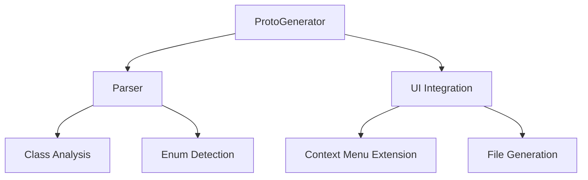
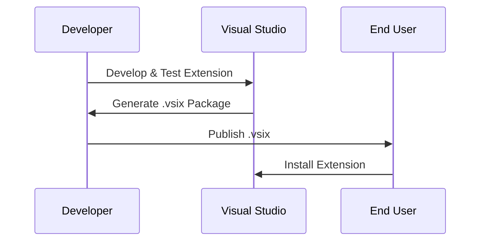

# ProtoGenerator - Visual Studio Extension

## Overview
ProtoGenerator è un'estensione per Visual Studio che consente di convertire classi C# in file **.proto** per l'uso con Protocol Buffers.

## Features
- Analizza automaticamente classi C# e genera file **.proto**
- Supporta la conversione delle proprietà pubbliche
- Integra un'opzione nel menu contestuale del **Solution Explorer**
- Compatibile con **.NET Framework 4.7.2**

## Prerequisites
- **Windows 10/11**
- **Visual Studio 2019 o superiore** con il workload per **.NET desktop development**
- **.NET Framework 4.7.2 SDK**

## Installation
1. Scaricare il file `.vsix` dalla sezione **Releases**.
2. Eseguire il file `.vsix` e seguire le istruzioni di installazione.
3. Riavviare Visual Studio.

## Usage
1. Aprire un progetto C# in Visual Studio.
2. Fare **clic destro** su una cartella nel **Solution Explorer**.
3. Selezionare **Convert to Proto**.
4. Il file `.proto` verrà generato nella stessa directory della classe selezionata.

## Project Structure

## Build & Deployment

## Contributing
1. Forkare il repository
2. Creare un nuovo branch (`feature/nome-funzionalità`)
3. Implementare le modifiche e fare commit
4. Creare una **Pull Request**

## License
Questo progetto è distribuito sotto la licenza MIT.
